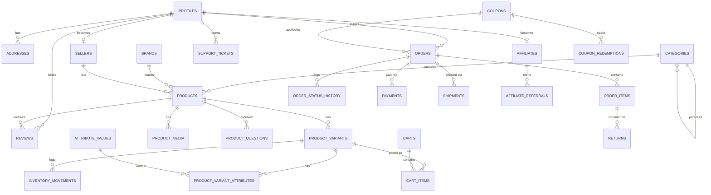

# Database Documentation

PostgreSQL schema (Supabase). Migrations live in `supabase/migrations/`, applied in filename order. Every table has Row Level Security (RLS) enabled — see the policy list at the end of each migration file.

## Applying migrations

```bash
# Local dev, via Supabase CLI (recommended)
supabase start
supabase db reset       # applies all migrations + supabase/seed/seed.sql

# Against a hosted project
supabase link --project-ref <project-ref>
supabase db push
```

The schema was also verified by applying every migration + the seed file to a throwaway plain PostgreSQL 16 database (with a minimal `auth.users`/`auth.uid()` stub standing in for Supabase-managed auth) and exercising the triggers end-to-end.

## Entity-Relationship Overview



## Table Reference

| Domain | Tables |
|---|---|
| Identity | `profiles`, `addresses` |
| Catalog | `categories`, `brands`, `products`, `attributes`, `attribute_values`, `product_variants`, `product_variant_attributes`, `product_media`, `inventory_movements`, `recently_viewed` |
| Sellers | `sellers` |
| Reviews & Q&A | `reviews`, `review_images`, `review_votes`, `product_questions`, `product_answers` |
| Shopping | `carts`, `cart_items`, `wishlist_items`, `compare_items` |
| Promotions | `coupons`, `coupon_scope_targets`, `coupon_redemptions`, `flash_sales`, `flash_sale_products` |
| Orders | `orders`, `order_items`, `order_status_history`, `payments`, `shipments`, `returns` |
| Content | `blog_categories`, `blog_posts`, `cms_pages` |
| Support | `support_tickets`, `support_messages`, `notifications`, `newsletter_subscribers` |
| Affiliates | `affiliates`, `affiliate_referrals` |
| System | `audit_logs`, `site_settings`, `email_templates` |

### Notable design decisions

- **`profiles`** is a 1:1 extension of `auth.users`, auto-created by the `handle_new_user()` trigger on signup. `role` (`customer`/`seller`/`admin`/`support`) is protected from self-escalation by `guard_profile_role_change()` — a customer can never `UPDATE` their own row into an admin.
- **Order snapshots**: `order_items` copies `product_name`, `sku`, `unit_price` at time of purchase so historical invoices stay accurate even if the product is later edited or deleted (`product_id`/`variant_id` are `ON DELETE SET NULL`).
- **Inventory** is tracked directly on `product_variants.stock_quantity`, with every change additionally recorded as an immutable row in `inventory_movements` (restock, sale, return, adjustment, damage) for audit and reporting.
- **Full-text search**: `products.search_vector` (tsvector, GIN-indexed) is kept in sync by a trigger and weighted (name > tags/short description > description) for relevance ranking; `pg_trgm` indexes support fuzzy/typo-tolerant matching for instant search.
- **Payment/order integrity**: `payments` and order status transitions are only ever written by server-side code using the Supabase **service role** (via webhook handlers), which bypasses RLS by design — no client-side policy allows a user to mark their own order "paid".
- **Guest carts**: `carts.session_id` supports anonymous shopping; the app merges a guest cart into `carts.user_id` on login (application logic in `src/lib/cart`).
- **Audit log** (`audit_logs`) has RLS enabled with **no client insert policy at all** — rows can only be written by the service role, keeping the trail tamper-proof.

## Indexes

Every foreign key has a supporting B-tree index. Additional indexes: GIN on `products.search_vector` and `products.tags`, trigram GIN on `products.name` for fuzzy search, partial indexes for `is_featured`/`is_trending`/`is_best_seller` flags, and a unique partial index enforcing one default address/variant per user/product.

## Row Level Security

All 30+ tables have RLS enabled. The common pattern:

- **Public catalog data** (`products`, `categories`, `brands`, reviews, blog): readable by anyone when `status = 'active'`/`published`, always readable by staff.
- **Owner-scoped data** (`addresses`, `carts`, `wishlist_items`, `orders`, `notifications`): `auth.uid() = user_id` on every operation.
- **Staff-only** (`admin`/`support` roles, via the `is_staff()` helper): full read/write on operational tables (inventory, coupons, settings).
- **Sellers**: scoped to their own listings via the `owns_product()` helper, joining `sellers.user_id = auth.uid()`.

See `docs/API.md` for how these policies map to the REST API's authorization checks (defense in depth: both layers enforce the same rules independently).
